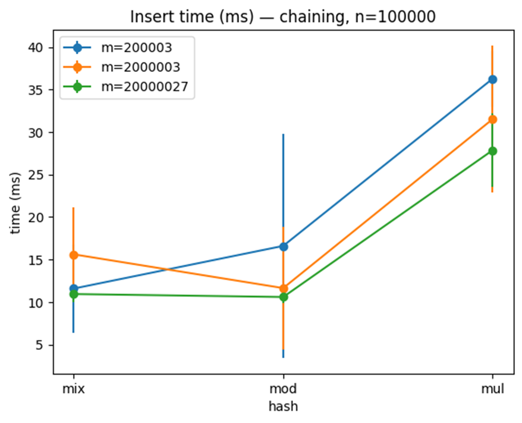
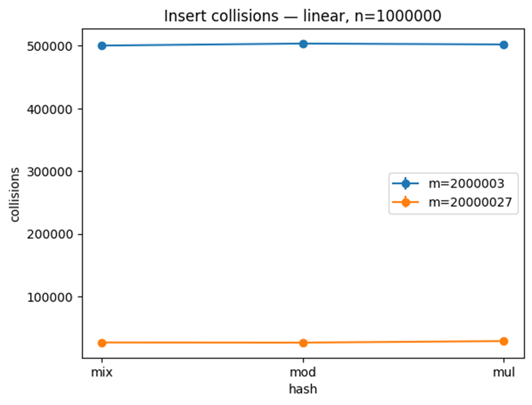

🧠 Análise de Desempenho de Tabelas Hash em Java

Este projeto implementa e analisa diferentes estratégias de tabelas hash em Java, considerando funções de hash e tamanhos de tabela variados, para diferentes tamanhos de conjuntos de dados.
Foram medidas métricas de tempo, colisões, distribuição e memória para comparar o desempenho de encadeamento separado, sondagem linear e hash duplo, em múltiplos cenários.

📌 1. Objetivos

Implementar ao menos uma estratégia de encadeamento e uma de endereçamento aberto (rehashing).

Testar diferentes funções de hash e tamanhos de tabela com conjuntos grandes de dados.

Medir tempos de inserção e busca, colisões, tamanhos de listas encadeadas e gaps.

Comparar os resultados com tabelas e gráficos.

(Bônus) Analisar overhead de memória em cenários grandes.

🧰 2. Tecnologias Utilizadas

Java 23 — Implementação das tabelas hash e gerador de dados.

Python (pandas + matplotlib) — Análise estatística e geração de gráficos a partir dos CSVs.

Nenhuma estrutura de dados pronta foi utilizada além de vetores (int[], String[]), conforme restrições da atividade.

🧪 3. Metodologia
Tamanhos das tabelas

Foram utilizados três tamanhos, com variação mínima de ×10:

200 003

2 000 003

20 000 027
(Valores primos para melhor dispersão.)

Funções de hash

mod: hash modular clássico

mul: método multiplicativo de Knuth

mix: combinação de xorshift + mod para dispersão aprimorada

Estratégias

Encadeamento separado (chaining)

Sondagem linear

Hash duplo

Conjuntos de dados

100 000, 1 000 000 e 10 000 000 registros gerados com seed fixa (42).
Cada registro é um inteiro de 9 dígitos (Registro).

Métricas medidas

Tempo de inserção e busca (ms)

Número de colisões

Top-3 maiores listas encadeadas

Gap médio, máximo e mínimo

(Bônus) Uso de memória

🧠 4. Como Executar
Compilar
javac -encoding UTF-8 -d out src/*.java

Rodar execução padrão
java -Xms2g -Xmx6g -cp out Main --repeats=1

Rodar execução bônus (3 repetições + memória)
java -Xms2g -Xmx6g -cp out Main --repeats=3

Os resultados serão salvos em results/metrics.csv.

📊 5. Análise e Geração de Gráficos

Após rodar os experimentos, execute:

python analyze_metrics_all.py

Isso gera:

results/summary/metrics_unificado.csv (dados agregados)

results/summary/*.csv (métricas por combinação)

results/summary/*.png (gráficos)

📈 6. Resultados
6.1 Tempo de Inserção

Figura 1 — Tempo de inserção para encadeamento separado, n=100000.

Figura 2 — Tempo de inserção para sondagem linear, n=1000000.

Figura 3 — Tempo de inserção para hash duplo, n=1000000.

6.2 Tempo de Busca

Figura 4 — Tempo de busca para encadeamento, n=1000000.

Figura 5 — Tempo de busca para hash duplo, n=1000000.

6.3 Colisões

Figura 6 — Número de colisões por função hash, sondagem linear, n=1000000.

6.4 Top-3 Listas Encadeadas
m	n	hash	Top1	Top2	Top3
200 003	100 000	mod	8	6	6
200 003	100 000	mul	6	6	6
200 003	100 000	mix	5	5	5
200 003	1 000 000	mod	19	19	17
200 003	1 000 000	mul	16	16	16
200 003	1 000 000	mix	17	17	17
200 003	10 000 000	mod	84	83	83
200 003	10 000 000	mul	85	84	83
200 003	10 000 000	mix	89	87	84

Tabela 1 — Top-3 listas encadeadas para m=200003 (valores médios).

6.5 Gaps
m	n	hash	média	máx	mín
200 003	100 000	mod	1.55	22	0
200 003	1 000 000	mod	0.0068	2	0
2 000 003	100 000	mod	19.51	238	0
2 000 003	1 000 000	mod	1.54	26	0
20 000 027	100 000	mod	199.46	2469	0
20 000 027	1 000 000	mod	19.51	284	0
20 000 027	10 000 000	mod	1.55	31	0

Tabela 2 — Estatísticas de gaps para encadeamento e função mod.

6.6 Uso de Memória (Bônus)

Figura 7 — Consumo de memória durante inserção para encadeamento.

💬 7. Discussão

Encadeamento separado foi mais robusto para altas cargas (n ≫ m), mantendo tempos proporcionais ao tamanho das listas encadeadas.

Sondagem linear degradou significativamente à medida que o fator de carga se aproximou de 1.

Hash duplo manteve tempos mais estáveis em cargas médias-altas.

A função mix apresentou melhor dispersão que mod e mul em cenários pequenos, com menos colisões.

Tabelas grandes e n pequeno resultaram em gaps enormes, mas com impacto pequeno no encadeamento.

🏁 8. Conclusão

O projeto confirmou os comportamentos clássicos das estratégias de hashing:

Encadeamento é versátil e eficiente mesmo quando n ≫ m.

Hash duplo combinado com funções de dispersão adequadas oferece melhor performance em endereçamento aberto.

Funções modulares simples são significativamente inferiores.

O uso de números primos para m e seed fixa foi essencial para resultados estáveis.

📂 9. Estrutura do Repositório
.
├── src/                 # Código comentado
├── src_no_comments/     # Código para prova de autoria
├── results/
│   ├── runs/            # CSVs brutos de execução
│   └── summary/         # CSVs agregados e gráficos gerados
├── analyze_metrics_all.py
└── README.md

🧪 10. Reprodutibilidade

Para reproduzir os resultados:

javac -encoding UTF-8 -d out src/*.java
java -Xms2g -Xmx6g -cp out Main --repeats=3
python analyze_metrics_all.py

Todos os dados utilizados estão versionados no repositório.
